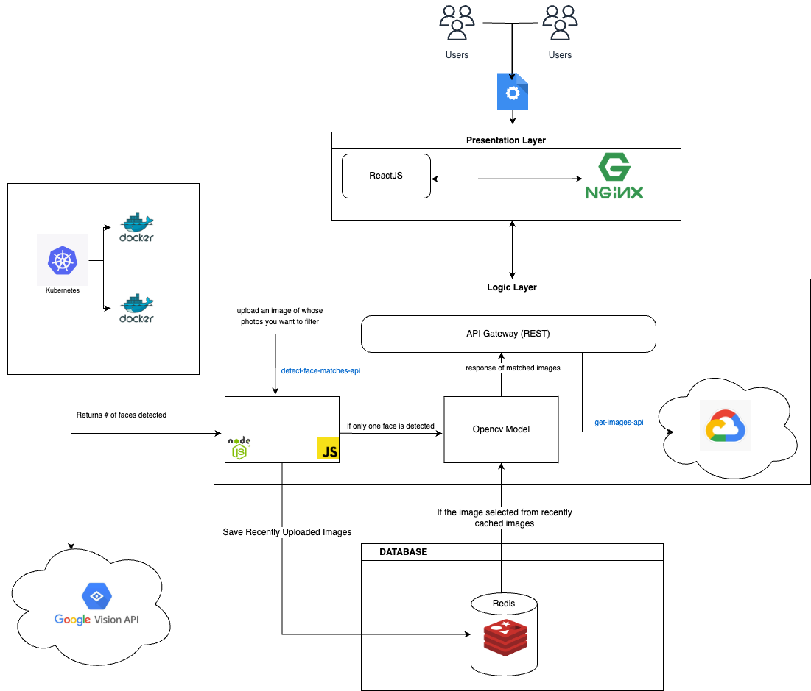

# AI Photo Management System (Pic Sorter AI)

Face Recognition and Matching System is a web application designed to streamline the process of organizing and retrieving photos using advanced AI techniques. Users can upload photos to identify faces and find matching images from their gallery. The application uses a combination of powerful tools and frameworks for efficient image processing and data management.



## Team Members:
- Tarun Kumar Nagelli
- Venkateshwarlu Mopidevi

## Table of Contents
1. Requirements
2. Installation
3. Working
4. Usage
5. Learnings

## Requirements
Ensure the following dependencies are installed:

- `opencv-python==4.8.1.78`
- `torchvision==0.16.1`
- `Flask==3.0.0`
- `Pillow==10.1.0`
- `pickle-mixin==1.0.2`
- `flask-cors==4.0.0`
- `pymongo==4.6.0`
- `Jinja2==3.1.2`
- `Flask-PyMongo==2.3.0`
- `jsonpickle==3.0.2`
- `redis==5.0.1`

## Installation
To install required libraries:

```bash
pip install -r requirements.txt
```

## Working
The project consists of several interconnected components that handle image uploading, processing, and result display.

### 1. **Frontend**
- Built with React.js, it provides an interactive interface for uploading and browsing images.
- Pulls images from the `get-images` API connected to Google Cloud Storage.
- Displays recent uploads in a dropdown menu for easy access.

### 2. **Backend**
- Developed with Flask and Node.js to handle requests and responses between components.
- Stores uploaded images in Redis as a cache and logs metadata (filename, upload time, status).

### 3. **Face Detection and Matching**
- Uses Google Vision API to detect the number of faces in an uploaded image.
  - If no or multiple faces are detected, an error is returned.
  - If one face is detected, the image is processed by OpenCV for face matching.
- OpenCV identifies similar faces in the gallery and sends results to the frontend.

### 4. **Storage and Caching**
- **Redis:** Maintains a cache of the five most recent uploads for quick access.
- **Google Cloud Storage:** Securely stores all images uploaded by users.

### 5. **Deployment**
- Utilizes Docker and Kubernetes for containerized deployment, ensuring consistency and scalability across all components.

## Usage
Follow the steps below to run the application:

### 1. **Run Redis:**

- Using Docker:
  ```bash
  docker run -d --name redis-stack -p 6379:6379 --net test-nw redis/redis-stack:latest
  ```
- Using Kubernetes:
  ```bash
  kubectl apply -f redis-deployment.yaml
  kubectl apply -f redis-service.yaml
  ```

### 2. **Run the Face Matching Server:**

- Using Docker:
  ```bash
  docker run --name face_matching_server -p 5001:5001 --net test-nw your-docker-image:latest
  ```
- Using Kubernetes:
  ```bash
  kubectl apply -f face-matching-deployment.yaml
  kubectl apply -f face-matching-service.yaml
  ```

### 3. **Run the Frontend Server:**

- Using Docker:
  ```bash
  docker run --name frontend_server -p 5000:5000 --net test-nw your-docker-image:latest
  ```
- Using Kubernetes:
  ```bash
  kubectl apply -f frontend-deployment.yaml
  kubectl apply -f frontend-service.yaml
  ```

### 4. **Access the Application:**

- Open your browser and go to [http://localhost:5000](http://localhost:5000) (or the Kubernetes-assigned port).

### 5. **Upload and Process Images:**

- Click on **"Choose File"** to upload an image.
- Click **"Upload"** to process the image and view results.
- Use the dropdown menu to select from recent uploads.

### 6. **View Results:**

- Processed images and matching results are displayed on the web interface.

## Learnings

1. Gained hands-on experience with deploying microservices using Docker and Kubernetes.
2. Enhanced understanding of integrating APIs, such as Google Vision API and OpenCV.
3. Improved skills in designing scalable and interactive web applications.
4. Learned to optimize image storage and retrieval using Redis.
5. Mastered implementing face recognition and matching techniques using AI models.

## Thank You
We express our heartfelt gratitude to everyone who guided and supported us throughout the development of the Face Recognition and Matching System. Your contributions have been invaluable in making this project a success.

